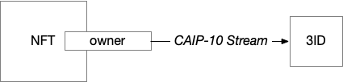

# **NFT DID Accounts**

---

!!! warning ""

    # **⚠️ NFT DID is experimental and ___not___ recommended for production use.** 
    The current implementation requires the current holder of an NFT with a corresponding did:nft to trust all previous holders of the NFT not to override the content of Ceramic streams controlled by the did:nft
    
    Please reach out in [Discord](https://chat.ceramic.network) to provide feedback or get help. 

The NFT DID Method (CIP-94) is an account that can perform transactions on streams. NFT DID accounts are controlled by the current owner of an NFT (non-fungible token). NFT DIDs are still very experimental, so use at your own risk.

## **What is an NFT account?**

---

The NFT DID Method turns every NFT into an account capable of controlling streams on Ceramic. Write permissions for streams whose [controller](../../../../learn/glossary.md#controllers) is set to an NFT DID are restricted to the DID account of the blockchain account that currently owns the NFT. When the NFT changes ownership on-chain, so do the Ceramic write permissions.
NFT DID is on the W3C's official DID method registry and is fully compliant with decentralized identity standards.

## **Example use cases for NFT accounts**

---

- **Extensible, mutable NFT metadata** – NFTs currently have fixed metadata that is created when the token is minted. But what if we want an NFT to be able to collect data over time? With NFT DID, an NFT owner can annotate an NFT with additional information that is modified over time, such as a social graph for the NFT, a story behind the artefact, owner-restricted content, or, for example, carbon offsetting certificate.

## **How to use NFT accounts**

---

### **Installation**

To use an NFT for dynamic stream access control, include the [nft-did-resolver](https://www.npmjs.com/package/nft-did-resolver) in your Ceramic node. 

### **Usage**

To create an NFT-controlled stream, set your stream controller to `did:nft:...` when creating it. Here's an example that creates a Tile Document controlled by an NFT:

```js
const didNFT =
    "did:nft:eip155:4_erc721:0xe2a6a2da2408e1c944c045162852ef2056e235ab_1";
const tile = await TileDocument.create(ceramic, {foo: "blah"}, {controllers: [didNFT]})
```

- The address of the NFT must be lowercase
- The `didNFT` string is a DID URI that references ERC721 token `1` on contract `0xe2a6a2da2408e1c944c045162852ef2056e235ab` deployed to Rinkeby (`eip155:4`). This should reference your NFT.
- We provide a helper function `createNftDidUrl` to create such a string:

```js
import { createNftDidUrl } from 'nft-did-resolver'
// "did:nft:eip155:4_erc721:0xe2a6a2da2408e1c944c045162852ef2056e235ab_1"
const didNFT = createNftDidUrl({
  chainId: 'eip155:1',
  namespace: 'erc721',
  contract: '0x1234567891234567891234567891234596351156',
  tokenId: '1',
})
```
    

Now the Tile Document we have just created can only be controlled by the NFT's current owner.

## **How it works**

---

When resolving an NFT DID account, Ceramic and the did-nft-resolver perform the following steps:

1. Query a blockchain for the NFT's owner(s) using a subgraph on The Graph protocol. 
2. For each owner, find a corresponding [CAIP-10 Link (CIP-7)](../stream-programs/caip10-link.md), which provides a link from blockchain account to Ceramic account. This determines who can write to the stream.
3. When a transaction is sent to the stream owned by the NFT,  verify the Ceramic account that signed the message is linked to the blockchain account that is a current owner.




Note: If you wish to build with NFT accounts, you need to ensure your users can generate [CAIP-10 Links](../stream-programs/caip10-link.md) to connect their blockchain account(s) to their Ceramic account. If you're using 3ID Connect, this is handled automatically by the wallet when signing in.

!!! warning ""

    Ensure 3ID Connect is on the same Ceramic network as your application. If those networks are different it will create a mismatch in Ceramic acounts that are linked to the same blockchain account (on testnet `0xethereum`→DID-A, on devnet for the same account `0xethereum`→DID-B). 
    Please make sure that the DID from a CAIP-10 Link  from your app corresponds to the DID you get from 3ID Connect.

## **Current limitations**

---

- Only [ERC-721](https://eips.ethereum.org/EIPS/eip-721) and [ERC-1155](https://eips.ethereum.org/EIPS/eip-1155) tokens are supported at this time.
- Only Ethereum Rinkeby, Etherem mainnet, and Polygon networks are supported by default. If you need other networks, see the [nft-did-resolver README](https://github.com/ceramicnetwork/nft-did-resolver),
and update network parameters and configuration of your Ceramic node. Notable, this config needs three additional [subgraphs](https://thegraph.com): for blocks, for ERC-721 and ERC-1155 tokens, and a "skew", which is a typical block time.

!!! warning ""

    Data from a subgraph might lag behing the current state found on the blockchain network. For example, if Etherscan reports the latest block number as 1000, a subgraph might still index block number 995. This could result in an error like `"invalid_jws: not a valid verificationMethod for issuer"`. If this occurs, make sure to repeat the transaction after some time, enough for the subgraph to catch up with the blockchain. In general, it is best practice to accommodate for this delay in your application.

## **Specification**

---

Read the [NFT DID Method (CIP-94) Specification](https://github.com/ceramicnetwork/CIP/blob/main/CIPs/CIP-94/CIP-94.md) for the full specificatoin.
