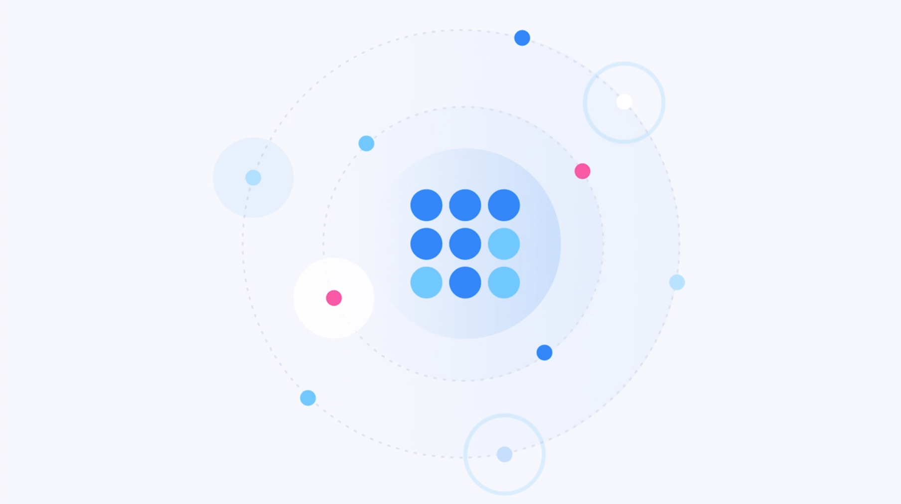

---
hide:
  - toc
---

# Introduction to Ceramic

Ceramic is a high-performance protocol for decentralized data applications. 

With Ceramic, developers can build applications that store, manipulate, and retrieve data from a highly-scalable, decentralized network.

is permissionless, composable, and self-sovereign. We cou 

We cou With Ceramic, developers can build and deploy applications which rely completely on decentralized, open-source protocols for storing, manipulating, and retrieving data in a censorship-free, permissionless, and self-sovereign manner. We cou With Ceramic, developers can build and deploy applications which rely completely on decentralized, open-source protocols for storing, manipulating, and retrieving data in a censorship-free, permissionless, and self-sovereign manner. We cou

## A powerful data platform for developers

---

**Ceramic is designed first and foremost as a platform for developing and hosting decentralized data applications.** We could start off by describing Ceramic as a replacement for your database, but that doesn't quite do it justice. Ceramic is a complete replacement for your entire data infrastructure stack. But this is the single player value. For developers, the ultimate value in Ceramic lies in the dataverse. Network effects, every new application that joins the network contributes back to the network effects. In the dataverse, ... Bootstrapping

- Programmable decentralized storage
- Flexibility – programmable data storage controlled by autonomous programs With schema validation, can write a new one if you need new data type or logic.
    - Configurable storage and archival
    - Unified app layer for archival networks
- Scalability and performance
- Content distribution network
- The dataverse, interoperability and open data APIs – share data states across applications. Data interoperability, Ever-expanding, composability, Reusable data models, community-powered data models universe, standards, protocols, programs
- Rich Developer Tools Ecosystem: DataModels Universe, developer tooling ecosystem
- Vibrant and Active Community

## Digital sovereignty for users

---

Filecoin enables users to store their files at hypercompetitive prices and verify that their files are being stored correctly. Users can choose their preferred trade-off between cost, redundancy, and speed by selecting the miner whose storage offer is best suited for their needs. Applications that implement Filecoin can negotiate storage with any miner on the network. Unlike centralized storage systems, there is no need to implement a different API for each provider.

At any time, users can verify that their files are being stored correctly by looking at proofs on Filecoin’s blockchain. Decentralized, self-sovereign, multi-account, cross-chain identity controlled by them. Ability to have sovereignty over your data, returning control to users. Decentralized identity. Ceramic has the most flexible decentralized identity and user account system in the world. Ceramic uses an account system based on DIDs and supports multi-account, cross-chain (MACC), a necessity in the dataverse to allow Alice to keep a unified identity control over her data even if she dabbles with a few different blockchain ecosystems. Accojunts are DIDs Everything can be represented as a DID, from single public-key accounts, to multi-account, cross-chain (MACC), bring your own, can use. Overview of features offered by Ceramic that make it a compelling platform for building data applications. This overview is intended for people already familiar with the basics of application development.

- Decentralized identity with account abstraction
- Data ownership and portability
- No lock-in
- Censorship resistance

!!! note ""
    
    [Follow us Into the Dataverse to start using Ceramic apps ↗]()

## A market for infrastructure providers

---

Ceramic enables infrastructure providers to offer their compute and storage resources to a market of users and applications.

Filecoin enables storage providers to sell their storage on an open market.

Storage providers are people and organizations that run miners, earning Filecoin tokens for doing so. A miner could be any internet-connected computer with spare disk space or a dedicated system with lots of storage built specifically for Filecoin. Filecoin’s blockchain rewards miners for contributing useful storage to the internet, not for completing wasteful proof-of-work computations.

Once a storage provider implements the Filecoin protocol, they gain access to the entire market of Filecoin users. Providers don’t need to design their own storage API or advertise their offering themselves as this is handled by Filecoin’s protocol and network. Filecoin enables a thriving, decentralized ecosystem of independent storage providers by removing barriers to entry.

- Future plans for cryptoeconomic/tokenized incentives

## Information liberation for humanity

---

a public, shared, community-owned platform, The dataverse, and interoperable web of information, owned by the community, independent, fair. A return to the original, independent roots of the internet, the way it was intended to be used.

- Shared, web-scale data network effects that are free, fair, and owned by the people (not companies or applications like Google or Meta)
- Open source code

