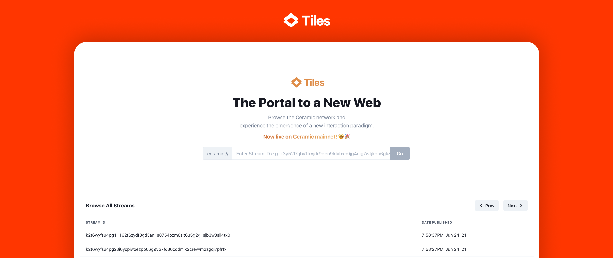

# Explorers

Discover various explorers for the Ceramic Network.

## **Cerscan**

[**Cerscan**]([https://cerscan.com/]) is a community-contributed explorer indexing streams in real-time since June 12, 2022. It includes information on the app and schema of recent streams too.

## **Tiles**

[**Tiles**](https://tiles.ceramic.community) is a browser-based explorer where you can see a feed of all streams created on mainnet, and dive into the details of any particular stream.

> Learn more about Tiles and their vision for enabling a world of open, shared data models in the [Tiles Spotlight](https://blog.ceramic.network/tiles-a-browser-for-open-source-information/).
