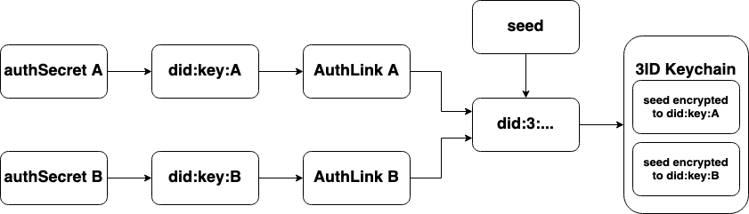

# 3ID Lifecycle

This page describes the complete lifecycle of a [3ID DID](../docs/advanced/standards/accounts/3id-did.md), including how the DID document is created, how keys are managed, and how [3ID Connect](../docs/advanced/standards/accounts/3id-did.md#3id-connect) uses these building blocks. Most of the logic described here is implemented in the [3id-did-provider](../docs/advanced/standards/accounts/3id-did.md#3id-did-provider) package.

The two core components to the 3ID lifecycle are the [3ID DID method](../docs/advanced/standards/accounts/3id-did.md) and the [3ID Keychain](https://github.com/ceramicnetwork/CIP/blob/main/CIPs/CIP-20/CIP-20.md) which is a standard for storing encrypted key material in a DID's [Identity Index](../docs/advanced/standards/application-protocols/identity-index.md).

## 3ID DID provider lifecycle

Every 3ID has a _seed_ which is the secret used to update the 3ID, sign messages, and decrypt messages as the 3ID. The 3ID DID provider manages this _seed_ using _authSecrets_. Each `authSecret` can be used to authenticate to the 3ID and thus get access to the _seed_.

### Creating a 3ID

To create a 3ID the _3id-did-provider_ accepts an `authSecret` and an `authId`. It roughly follows the following algorithm.

1. We have an `authSecret A` that is used to create `did:key:A` using the [`key-did-provider-ed25519`](../reference/accounts/key-did.md#ed25519) provider
1. A deterministic TileDocument, referred to as _AuthLink_, is created. If this is a new `authSecret` the loaded _AuthLink_ will be empty
1. A seed for the 3ID is randomly generated; two asymmetric keys (`signing`, and `encryption`), and a `did:key:management-1` are derived from the seed. A stream for the 3ID DID document is created with `did:key:management-1` as the _controller_, the `signing` and `encryption` public keys are stored in the streams content
1. The seed is encrypted to `did:key:A`
1. The encrypted seed is put into the 3ID Keychain, which is an Identity Index record associated with the 3ID from step 3
1. The _AuthLink_ document is updated to contain the 3ID from step 3.

### Loading an existing 3ID

If an `authSecret` has already been associated with a 3ID then this 3ID will be loaded instead of a new one created. Once authenticated the user can make updates to the 3ID document itself, as well author signatures and decrypt messages as the 3ID.

1. `authSecret A` is used to create `did:key:A` using the [`key-did-provider-ed25519`](../reference/accounts/key-did.md#ed25519) provider.
1. A deterministic TileDocument, referred to as _AuthLink_, is created. If this is an existing `authSerect` the loaded _AuthLink_ contain a 3ID
1. Using the 3ID from the previous step we can deterministically load the 3ID keychain
1. Decrypt the seed in the 3ID Keychain that was encrypted to `did:key:A`

### Adding a new `authSecret`

We can add a new `authSecret` with two simple steps.

1. `authSecret B` is used to create `did:key:B`
1. The `seed` is encrypted to `did:key:B` and stored in the 3ID Keychain
1. An _AuthLink_ stream is created for `did:key:B` and updated to link to the 3ID

### Revoking an `authSecret`

Assume that we have `authSecret A` and `authSecret B` associated to our 3ID, and we want to revoke `authSecret A`. Lets refer to the current seed as `seed 1`. Note that you should always end up with at least one `authSecret` in the end. It doesn't make sense to revoke all _authSecrets_ as there no longer would be a way to authenticate to this 3ID.

1. Randomly generate a new seed, `seed 2`
1. Two asymmetric keys (`signing`, and `encryption`), and a `did:key:management-2` are derived from `seed 2`. The 3ID stream for the 3ID DID document is updated with `did:key:management-2` as the _controller_, the `signing` and `encryption` public keys in the content
1. The `seed 1` is encrypted to `seed 2` and stored in the 3ID Keychain, so that we can use it to decrypt any message encrypted to the previous version of the 3ID document
1. `seed 2` is encrypted to `authSecret B` but **not** to `authSecret A`
1. The encrypted `seed 2` is stored in the 3ID keychain

After these steps are taken, `authSecret A` can no longer be used to authenticate to the 3ID.

## Usage in 3ID Connect

A natural question at this point is: _Where does these authSecrets come from?_ In 3ID Connect normal blockchain wallets are used to create these secrets in the following way.

1. A signature of some static message is requested from the users wallet, e.g. MetaMask
1. If the user accepts a signature is returned
1. The entropy (randomness) of the signature is now used as an `authSecret` (we take the hash of the signature to get the `authSecret`), in addition 3ID Connect will use the wallet AccountID as the `authId`

Note that this relies on the wallet making deterministic signatures, such that we can get the same `authSecret` every time.

In addition to the authentication flow, 3ID Connect also creates a _Caip10Link_ from the wallet AccountID to the 3ID. This allows application developers to query the users 3ID using an Ethereum address for example. The _Caip10Link_ is also stored in the users [CryptoAccounts](https://github.com/ceramicnetwork/CIP/blob/main/CIPs/CIP-21/CIP-21.md) Identity Index definition.
