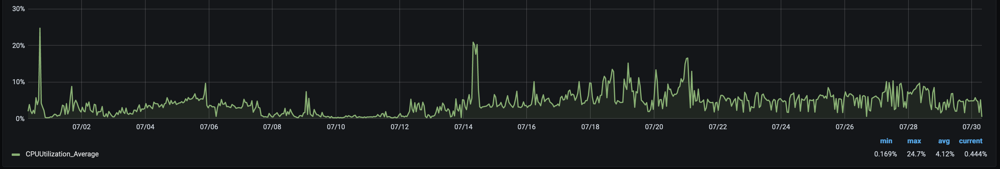

# Graphite: Installation and Setup

This guide covers how to install the Graphite CLI application and launch a Ceramic node. This guide covers installing Graphite to your computer, and walks through the process of setting up a Graphite node.

> Some callout about running in the cloud if you want to...

## Minimal Requirements

---

To run a Graphite node, your computer must have:

- macOS, Linux, or Windows
- 8-core CPU, 32 GiB RAM. Models with XXX or XXX will significantly speed things up.
- Enough space to store your streams (very light)

The 3Box team runs Ceramic and out-of-process IPFS nodes in containers with AWS ECS. We have allocated 4096 CPU units (4 vCPU) and 8192 MiB (8 GB) of memory for each node. On the Clay testnet, the 3Box public Ceramic node serves about **87,000 requests per day**.

The Ceramic node uses less than 7% of CPU at any given time and requires about 0.5 GB of memory.


The IPFS node uses less than 30% of CPU at any given time and requires about 2.5 GB of memory. (Notice that js-ipfs appears to have a memory leak so we have our AWS service configured to auto-restart on crash.)




Installing the CLI requires a console, [Node.js](https://nodejs.org/en/){:target="\_blank"} v14, and [npm](https://www.npmjs.com/get-npm){:target="\_blank"} v6. Make sure to have these installed on your machine.

!!! warning ""

    While npm v7 is not officially supported, you may still be able to get it to work. You will need to install the `node-pre-gyp` package globally. This is required until `node-webrtc` which IPFS depends on [is upgraded](https://github.com/node-webrtc/node-webrtc/pull/694){:target="_blank"}.

    ```bash
    npm install -g node-pre-gyp
    ```


## Linux

---

The following instructions are specific to Linux installations. There are several ways to install Graphite on Linux:

## macOS

---

Open your console and install the CLI using npm.

```bash
npm install -g @ceramicnetwork/cli
```

## Start the daemon

---

This starts a local JavaScript Ceramic node on the [Clay Testnet](../../learn/networks.md#clay-testnet) at `https://localhost:7007`. The js-ceramic node is run as a daemon using Docker or Node.js. By default, Ceramic will run an in-process IPFS node on start and will connect to the Clay testnet and the Ropsten [Ceramic Anchor Service](https://github.com/ceramicnetwork/ceramic-anchor-service).

```bash
ceramic daemon
```

This `localhost` setup allows you to read streams from other nodes connected on the same [network](../../learn/networks.md), but writes to your local node will only be available on your local node and on other nodes found on the [`peerlist`](https://github.com/ceramicnetwork/peerlist/blob/main/testnet-clay.json). They will not be available to every node on the network. For greater connectivity, you might want to connect your CLI to a remote long-lived Ceramic node.

Ceramic and IPFS will not automatically restart if they crash. You should configure your own restart mechanism and you must ensure data persistence between restarts. If the multiaddress changes for any reason (your node goes down or restarts without pulling in an existing config file), your node will regenerate this file upon restarting with a new address and all other nodes on the network will lose connection to you. 


## Interact with the daemon

---

## Stop the daemon

---


## Additional Resources

---

### Guides

### Next Steps

- [Next step 1]()
- [Next step 2]()
- [Next step 3]()

---

Was this page helpful? Y / N

[Edit this page]() on GitHub or [open an issue]()