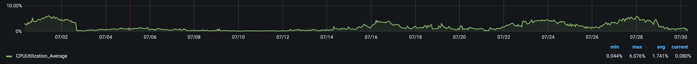
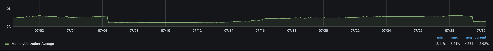
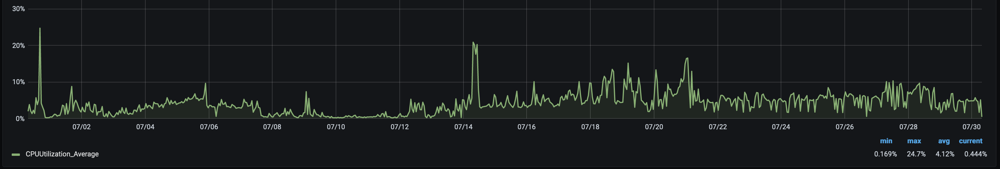
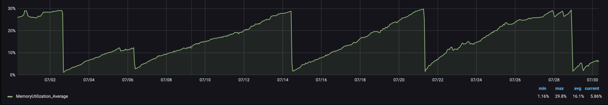

# Hosting a node

This guide describes how to run a Ceramic node that can be used as a remote node by the [JS HTTP Client](../../build/javascript/installation.md#js-http-client) or the [CLI](../../build/cli/installation.md#4-configure-a-node-url). It is best to start by connecting to the Clay testnet, however, you do not need to run your own node to use testnet. You can get started with Ceramic right away by using a community node: [https://developers.ceramic.network/run/nodes/community-nodes/](https://developers.ceramic.network/run/nodes/community-nodes/)

When you are ready to get on mainnet, reach out to the 3Box team on Discord: [https://discord.gg/tsQXsG8Sde](https://discord.gg/tsQXsG8Sde). For now, mainnet is currently limited to early partners.

---

## Getting Started

The following is an overview of the steps you must take to run a Ceramic node. Details for each step are described in this document.

1.  Running the Daemon

    Determine if you want to run IPFS in-process or [out-of-process](#ipfs-out-of-process).

2.  Data Persistence

    Determine your mechanism for data persistence and ensuring your IPFS multiaddress will not change.

    !!! warning ""

        Data persistence is the most critical step to properly run a Ceramic node. It is critical to persist the multiaddress for network connectivity, and the Ceramic State Store and IPFS Repo to persist stream data, as there are currently no guarantees that another node is keeping a copy of the data. 

3.  Resource Allocation and Networking

    Run your Ceramic node and IPFS with data persistence and networking configured.

4.  Staying Connected

    Submit a pull request to the [Ceramic peerlist](https://github.com/ceramicnetwork/peerlist) with the multiaddress of your IPFS node, the IP address for your Ceramic node, and a description of the data persistence setup for the multiaddress, Ceramic State Store and IPFS Repo. Once your pull request is merged in you will be connected to the Ceramic network and the [Ceramic Anchor Service](https://github.com/ceramicnetwork/ceramic-anchor-service).
    
    !!! info ""
 

        Mainnet nodes will not run immediately after start up until your IP address is added to the allow list for the 3Box hosted anchor service and your PR to the peerlist is merged.


## Running the Daemon

The js-ceramic node is run as a daemon using Docker or Node.js. By default, Ceramic will run an in-process IPFS node on start and will connect to the Clay testnet and the Ropsten [Ceramic Anchor Service](https://github.com/ceramicnetwork/ceramic-anchor-service).

**Configuration**

The Ceramic daemon can be configured with a JSON file which is created on start and located at `$HOME/.ceramic/daemon.config.json`. Configuration options can be viewed in the [reference documentation for the DaemonConfig class](https://developers.ceramic.network/reference/typescript/classes/_ceramicnetwork_cli.daemonconfig.html).
You may also set these options with command line flags which can be viewed from the Ceramic CLI with `ceramic daemon --help`, but note that these CLI flags are deprecated.

#### IPFS Out-of-process

The Ceramic daemon by default will start its own IPFS node internally, but it can also be configured to connect to an externally running IPFS node over HTTP. We refer to the latter as running IPFS "out-of-process". Running IPFS out-of-process is helpful for more controlled resource allocation, maintenance, debugging, and observability. This is highly recommended, especially if you are planning to be an infrastructure provider for other Ceramic applications.

When connecting to an out-of-process IPFS node, it is important that the IPFS node be configured with support for the dagJose plugin that Ceramic relies on. DagJose support is not included in IPFS by default, so we have provided the [@ceramicnetwork/ipfs-daemon package](https://www.npmjs.com/package/@ceramicnetwork/ipfs-daemon), which is a wrapper around js-ipfs configured with dagJose support specifically for use with Ceramic. Configuration options for the IPFS daemon can be viewed in the [ipfs-daemon README](https://github.com/ceramicnetwork/js-ceramic/tree/develop/packages/ipfs-daemon) and in the [ipfs-daemon source code](https://github.com/ceramicnetwork/js-ceramic/blob/develop/packages/ipfs-daemon/src/ipfs-daemon.ts).

The rest of this guide assumes you are running IPFS out-of-process.

**Networks**

There are currently three Ceramic networks: `mainnet`, `testnet-clay`, and `dev-unstable`. Learn more about each network here: [https://developers.ceramic.network/learn/networks/](https://developers.ceramic.network/learn/networks/)

**Process Management**

Ceramic and IPFS will not automatically restart if they crash. You should configure your own restart mechanism and you must ensure data persistence between restarts. If the multiaddress changes for any reason (your node goes down or restarts without pulling in an existing config file), your node will regenerate this file upon restarting with a new address and all other nodes on the network will lose connection to you. 

### Terraform

The 3Box team has written a [Terraform module](https://github.com/ceramicnetwork/terraform-aws-ceramic) that configures Ceramic and IPFS in AWS ECS. Using this module is the fastest way to run Ceramic in the cloud. It runs Ceramic and IPFS out-of-process in containers using Docker images. This module currently requires some common AWS resources to be pre-configured as well as Cloudflare. You can see an example of the module in use here: [https://github.com/ceramicnetwork/terraform-aws-ceramic/blob/main/examples/ecs/main.tf](https://github.com/ceramicnetwork/terraform-aws-ceramic/blob/main/examples/ecs/main.tf)

We highly encourage others to create Terraform modules for other infrastructure providers and using different platforms.

### Docker

The js-ceramic repo builds Docker images that run the Ceramic daemon and IPFS from the source code of the master branch. These images are tagged with "latest" and the git commit hash of the source code that the image was built from. You can view the image builds of [js-ceramic on DockerHub](https://hub.docker.com/r/ceramicnetwork/js-ceramic) and compatible builds of IPFS with the image builds of [ipfs-daemon on DockerHub](https://hub.docker.com/r/ceramicnetwork/ipfs-daemon).

```bash
docker pull ceramicnetwork/ipfs-daemon:latest

docker run -d -p 4011:4011 -p 5011:5011 -e CERAMIC_NETWORK=mainnet --name ipfs-daemon ceramicnetwork/ipfs-daemon:latest

# Get the IP address
docker inspect -f \
  '{{range .NetworkSettings.Networks}}{{.IPAddress}}{{end}}' \
  ipfs-daemon

docker pull ceramicnetwork/js-ceramic:latest
```

#### Option A. Run Ceramic configured via JSON file
```
docker run -d \
  -p 7007:7007 \
  -v /path_for_daemon_config:/root/.ceramic/daemon.config.json \
  -v /path_for_ceramic_logs:/root/.ceramic/logs \
  -v /path_for_ceramic_statestore:/root/.ceramic/statestore \
  --name js-ceramic \
  ceramicnetwork/js-ceramic:latest
```
See: [Example daemon.config.json](#example-daemonconfigjson)

#### Option B. Run Ceramic configured via CLI flags
```
docker run -d \
  -p 7007:7007 \
  -v /path_for_ceramic_logs:/root/.ceramic/logs \
  -v /path_for_ceramic_statestore:/root/.ceramic/statestore \
  --name js-ceramic \
  ceramicnetwork/js-ceramic:latest \
  --network mainnet \
  --ethereum-rpc https://eg_infura_endpoint \
  --log-to-files \
  --ipfs-api http://ipfs_ip_address_from_above:5011
```

### NPM

The [js-ceramic CLI](https://www.npmjs.com/package/@ceramicnetwork/cli) and [ipfs-daemon](https://www.npmjs.com/package/@ceramicnetwork/ipfs-daemon) are available as public NPM modules. They are currently compatible with **Node.js version 14**. After a global installation, the daemons can be run from the command line.

```bash
npm install -g @ceramicnetwork/ipfs-daemon
export CERAMIC_NETWORK=mainnet # Set the Ceramic network for the IPFS node
ipfs-daemon

# In a new shell, configure Ceramic to use IPFS

npm install -g @ceramicnetwork/cli
```

#### Option A. Run Ceramic configured via JSON file
```bash
ceramic daemon
```
See: Example [daemon.config.json](#example-daemonconfigjson)

#### Option B. Run Ceramic configured via CLI flags
```
ceramic daemon \
  --network mainnet \
  --ethereum-rpc https://eg_infura_endpoint \
  --log-to-files \
  --ipfs-api http://localhost:5011 # Remove this line to run IPFS in-process
```

### Example daemon.config.json
```json
{
    "anchor": {
        "ethereum-rpc-url": "https://eg_infura_endpoint" // Replace with an Ethereum RPC endpoint to avoid rate limiting
    },
    "http-api": {
        "cors-allowed-origins": [
            ".*"
        ]
    },
    "ipfs": {
        "mode": "remote", // Use "remote" for IPFS out-of-process or "bundled" for in-process
        "host": "http://ipfs_ip_address:5011"
    },
    "logger": {
        "log-level": 2, // 0 is most verbose
        "log-to-files": true
    },
    "network": {
        "name": "mainnet", // Connect to mainnet, testnet-clay, or dev-unstable
    },
    "node": {},
    "state-store": {
        "mode": "fs",
        "local-directory": "/path_for_ceramic_statestore" // Defaults to $HOME/.ceramic/statestore
    }
}
```

## Data Persistence

To run a Ceramic node in production, it is critical to persist the multiaddress, IPFS repo and the Ceramic state store. The form of storage you choose should also be configured for disaster recovery with data redundancy, some form of snapshotting and/or backups.

**Loss of this data can result in permanent loss of Ceramic streams and will cause your node to be in a corrupt state.**

The IPFS repo and the Ceramic state store are stored on your machine's filesystem by default. The IPFS repo defaults to a directory called `ipfs` located wherever you run the `ceramic daemon` command (or the `ipfs-daemon` process when running IPFS out-of-process). The Ceramic state store defaults to `~/.ceramic/statestore`.

The fastest way to ensure data persistence is by mounting a persistent volume to your instances and configuring the Ceramic and IPFS nodes to write to the mount location. The mounted volume should be configured such that the data persists if the instance shuts down.

You can also use AWS S3 for data storage which is supported for both Ceramic and IPFS. Below are examples of the configuration for both storage options.

### IPFS Repo

The IPFS repo holds configuration settings and all the raw IPFS data for the Ceramic streams used by your node. It is essential to keep the file names `config` generated by IPFS so that your node can stay connected to the Ceramic network. This file is located at the root of the IPFS repo directory.

!!! info ""
The IPFS config file holds your node's private key which is used to generate your node's peerId and multiaddress. If this file is deleted it will be re-created on start with a different key, peerId and multiaddress. This will result in your node and the rest of the network not being able to connect to each other.

!!! warning ""
Environment variables should be written to your profile file, or otherwise injected into your environment on start so that they persist between reboots.

#### **Option A. Volume Storage**

```bash
# Environment variable to use a mounted volume for IPFS persistence
export IPFS_PATH="/mnt_volume_path_for_ipfs"
```

#### **Option B. AWS S3**

```bash
# Environment variables to use S3 for IPFS persistence
export IPFS_S3_REPO_ENABLED="true"
export IPFS_PATH="directory_for_the_bucket"
export AWS_BUCKET_NAME="bucket_name"
export AWS_ACCESS_KEY_ID="aws_access_key_id"
export AWS_SECRET_ACCESS_KEY="aws_secret_access_key"
export IPFS_BACKEND_ROOT="s3"
export IPFS_BACKEND_BLOCKS="s3"
export IPFS_BACKEND_KEYS="s3"
export IPFS_BACKEND_PINS="s3"
export IPFS_BACKEND_DATASTORE="s3"
```

```json
// IPFS AWS S3 policy for the access key
{
  "Version": "2012-10-17",
  "Statement": [
    {
      "Action": [
        "s3:GetObject",
        "s3:ListBucket",
        "s3:PutObject",
        "s3:DeleteObject"
      ],
      "Effect": "Allow",
      "Resource": ["ipfs_bucket_arn", "ipfs_bucket_arn/*"]
    }
  ]
}
```

### Ceramic State Store

The Ceramic state store holds commits for pinned streams and the acts as a cache for the Ceramic streams that your node creates or loads. To ensure that the data you create with your Ceramic node does not get lost you must pin streams you care about and you must ensure that the state store does not get deleted.

#### **Option A. Volume Storage**

Using `daemon.config.json`
```json
    "state-store": {
        "mode": "fs",
        "local-directory": "/mnt_volume_path_for_statestore",
    },
```

Using CLI flags
```bash
# CLI flag to use a mounted volume for Ceramic state store persistence
ceramic daemon --state-store-directory /mnt_volume_path_for_statestore
```

#### **Option B. AWS S3**

Using `daemon.config.json`
```json
    "state-store": {
        "mode": "s3",
        "s3-bucket": "bucket_name"
    },
```

Using CLI flags
```bash
# CLI flag to use S3 for Ceramic state store persistence
ceramic daemon --state-store-s3-bucket bucket_name
```

Ceramic state store AWS S3 policy for the access key
```json
{
  "Version": "2012-10-17",
  "Statement": [
    {
      "Action": [
        "s3:ListBucket",
        "s3:GetObject",
        "s3:PutObject",
        "s3:DeleteObject"
      ],
      "Effect": "Allow",
      "Resource": ["state_store_bucket_arn", "state_store_bucket_arn/*"]
    }
  ]
}
```

## Resource Allocation

The 3Box team runs Ceramic and out-of-process IPFS nodes in containers with AWS ECS. We have allocated 4096 CPU units (4 vCPU) and 8192 MiB (8 GB) of memory for each node. On the Clay testnet, the 3Box public Ceramic node serves about **87,000 requests per day**.

The Ceramic node uses less than 7% of CPU at any given time and requires about 0.5 GB of memory.




The IPFS node uses less than 30% of CPU at any given time and requires about 2.5 GB of memory. (Notice that js-ipfs appears to have a memory leak so we have our AWS service configured to auto-restart on crash.)




## Networking

### Ceramic

The Ceramic daemon serves an API that you will use to interact with your Ceramic node. The default API port is `7007`. Make sure this port is available to whatever clients you plan to use.

!!! info ""
Healthchecks can be run against the API endpoint `/api/v0/node/healthcheck`.

### IPFS

Your Ceramic node connects to the Ceramic network by using IPFS. IPFS nodes connect to each other using a Libp2p module called "switch" (aka "swarm"). This module operates over a websocket, on port `4011` by default. The websocket port must be accessible by the internet so your Ceramic node can be connected to the network.

!!! info ""
We recommend using SSL for a secure websocket (port `4012` by default).

!!! info ""
Healthchecks can be run against the `HEALTHCHECK_PORT` (port `8011` by default) when `HEALTHCHECK_ENABLED` is `true`.

#### **Out-of-process**

When running IPFS out-of-process, its API port must be accessible by the Ceramic node. The default API port is `5011`. The IPFS node address will then be passed to Ceramic with a CLI flag `--ipfs-api <ipfs_api_url>`.

## Staying Connected

The ipfs-daemon designed for use with Ceramic has the IPFS node discovery mechanism, Libp2p DHT, turned off. We have configured this by default because the JavaScript implementation of the DHT is not yet reliable. With node discovery turned off, we must manually create a connected network of peers by sharing known addresses and dialing them explicitly. The ipfs-daemon package handles this logic and requires that every node that wants to be in the network be in a "peerlist" which is maintained here: [https://github.com/ceramicnetwork/peerlist](https://github.com/ceramicnetwork/peerlist)

#### Peerlist

Once you have fully configured your Ceramic node with this guide and have a way to persist its configuration and state, submit a pull request to the peerlist with the multiaddress of your IPFS node, the IP address for your Ceramic node, and a brief description of your data persistence setup for the Ceramic State Store and IPFS Repo. When a pull request is submitted, it triggers a connectivity test to ensure the node can successfully connect to the network. If this fails, the 3Box Labs team will reach out to you directly to triage the issue. Make sure there are no firewalls blocking your instance and that your port is properly exposed. Once your multiaddress is added, you will be able to stay connected to other nodes in the network.

Once you are on the peerlist, you should monitor your IPFS node and alert our team on Discord in the case of any planned or unexpected downtime. Please make your best effort to come back online within 24 hours. If we can not connect to your IPFS node for over 24 hours, we will remove it from the peerlist and you can resubmit your multiaddress in a new PR once your node becomes stable again. If the connectivity test in your PR to the peerlist fails and it is due to a node other than your own, we will update the peerlist and re-run the tests for you.

## Observability

Ceramic has a debug mode that you can enable using the `--debug` flag. This will allow you to see all logs printed to your console, including debug logs, API requests, events, and errors.

For observability, it is best to have these logs written to files to debug any issues and to generate metrics. Logging to files can be enabled with the `--log-to-files` flag. The default location for logs is `~/.ceramic/logs` but this path can be configured with the `--log-directory` flag. Without debug mode enabled you will still get critical logs and metrics written to files.

Request and event logs are written in [logfmt](https://brandur.org/logfmt). This makes them easy to import into [Grafana](https://grafana.com/) dashboards using a log scraping agent like [Promtail](https://grafana.com/docs/loki/latest/clients/promtail/) and a log aggregator like [Loki](https://grafana.com/docs/loki/latest/), which can be used as a data source for Grafana. An example of such a setup can be found here: [https://github.com/3box/ceramic-stats](https://github.com/3box/ceramic-stats)

## **Next steps**

Congratulations! You have now set up a hosted Ceramic node that is ready to receive HTTP requests from the local environment, the [JS HTTP Client](../../build/javascript/installation.md#js-http-client), the [CLI](../../build/cli/installation.md#4-configure-a-node-url), or to simply serve as another node to replicate and pin streams. Please report any bugs as issues at https://github.com/ceramicnetwork/js-ceramic.
